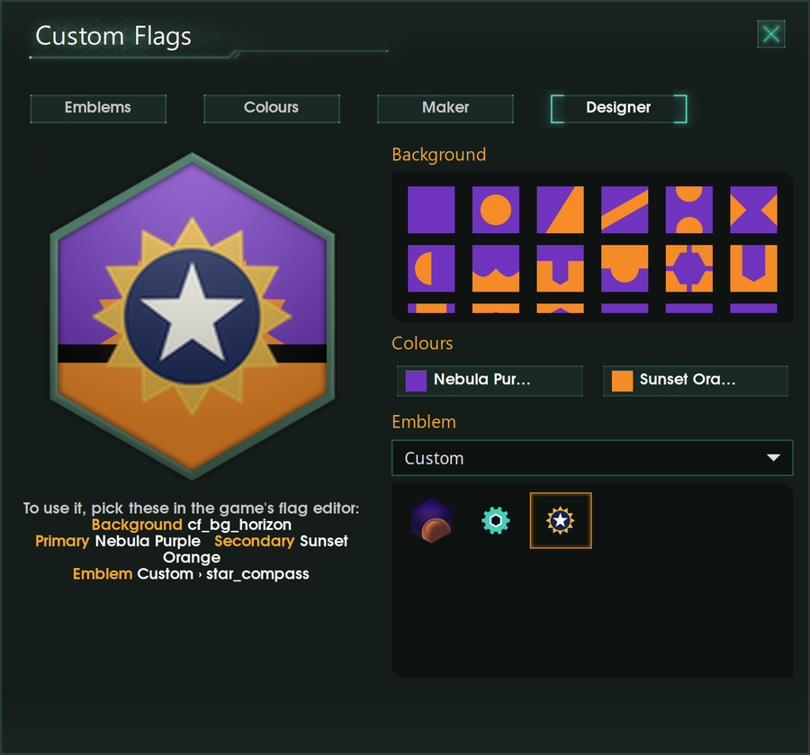
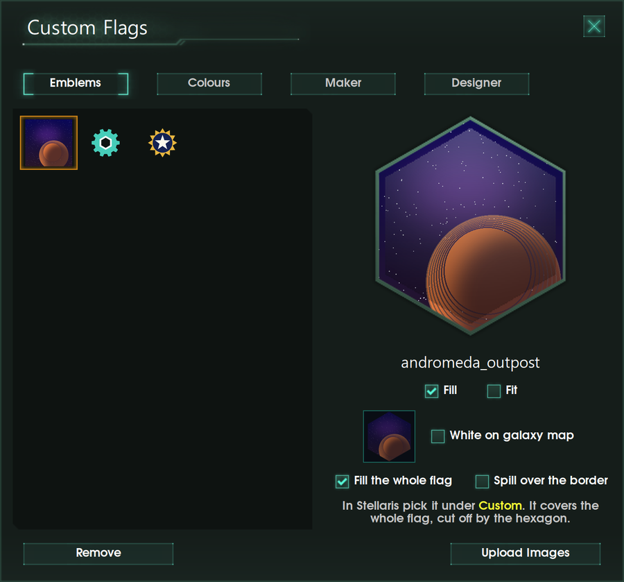
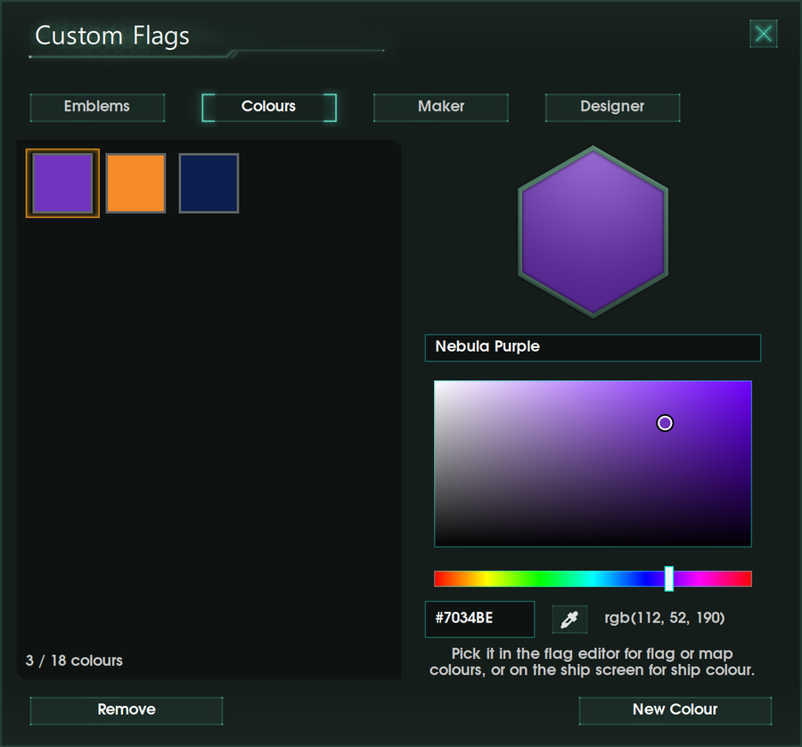
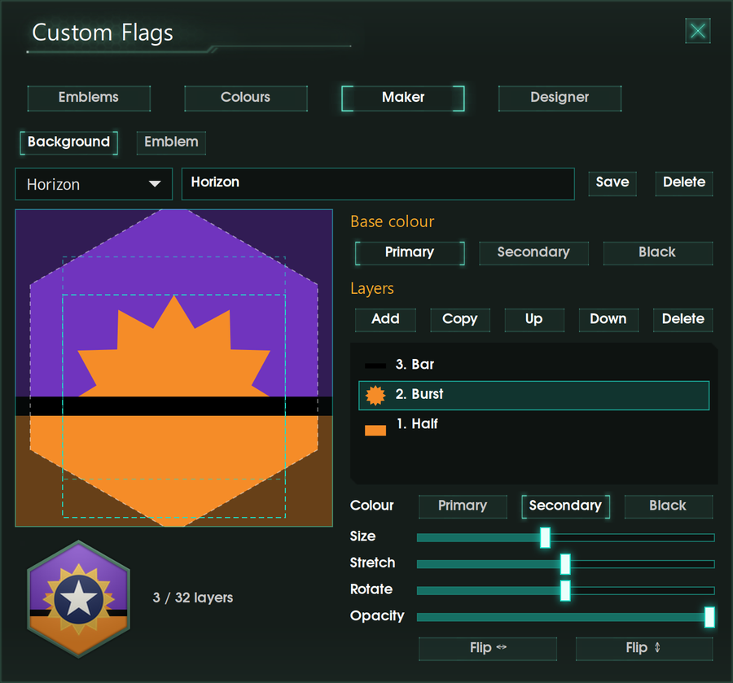

# Stellaris Custom Flags: Custom Flag Mod & Flag Maker for Stellaris

**Use your own images as your empire's flag in Stellaris.** Stellaris Custom
Flags is a free custom flag mod plus an easy flag maker app: upload any picture
as an emblem, pick any colour (not just the built-in swatches), design your own
flag backgrounds and emblems in a layer editor, and preview your flag exactly as
the game draws it. No modding experience needed.

## Download

**[Download the latest version](https://github.com/idiotgamster420/stellaris-custom-flags/releases/latest)** for Windows or Linux:

- **Windows 10/11:** `StellarisFlagUploader-Setup.exe`, a normal installer (no admin rights needed)
- **Linux:** `Stellaris_Flag_Uploader-x86_64.AppImage`, one file with nothing else to install

Also on the **[Steam Workshop](https://steamcommunity.com/sharedfiles/filedetails/?id=3814981310)**: example emblems and backgrounds, and a brighter emblem picker.

## What you can do

- **Upload your own images as flag emblems**: PNG, JPG, WebP and more. They
  appear in a new "Custom" category in the game's flag editor.
- **Fill the whole flag with a picture**: images can cover the entire hexagon
  instead of the small emblem square, cut neatly to the flag's shape, or spill
  over its border for things like a sun breaking out of the corner.
- **Custom flag colours**: make exact colours with a colour picker, hex code or
  `rgb()` value, including an eyedropper that takes colours from anywhere on
  screen. They're added to the game's flag, map border and ship colour pickers.
- **Flag background maker**: stack shapes in layers (circles, stars, chevrons,
  cogs, any game emblem, your own images), Black Ops 2 emblem editor style.
  Backgrounds follow your empire's colours in game, like the built-in ones.
- **Emblem editor**: the same layer editor for making emblems in any colours.
- **Flag designer**: try backgrounds, colours and emblems together, drawn the
  way Stellaris draws them, and see exactly what to pick in game.
- **Galaxy map emblems** are handled for you: logos show as clean white
  silhouettes like the game's own, photos in colour (you can switch).
- **Flag packs for friends and multiplayer**: the Share tab saves everything you
  made (emblems, backgrounds, colours, designs) to one .zip, and imports a
  friend's. Before replacing anything of yours, it shows what will change.
- **Easier emblem picking**: the game's emblem picker gets a lighter slot
  background, so dark emblems don't disappear on black.

| Upload your own emblems | Custom colours |
| --- | --- |
|  |  |

## How to use it (step by step)

1. **Download the app.** Open the
   [latest release](https://github.com/idiotgamster420/stellaris-custom-flags/releases/latest),
   scroll down to **Assets**, and click the file for your computer:
   `StellarisFlagUploader-Setup.exe` (Windows) or
   `Stellaris_Flag_Uploader-x86_64.AppImage` (Linux).
2. **Install and open it.**
   - **Windows:** double-click the downloaded file. If a blue box says
     "Windows protected your PC", click **More info**, then **Run anyway**
     (the installer isn't code-signed, which costs money every year). Click
     **Next** through the installer, then **Finish**, and the app opens.
   - **Linux:** right-click the AppImage, choose **Properties** →
     **Permissions**, tick **Allow executing file as program**, then
     double-click it.

   The first time it opens, it creates a mod called **Custom Flags** in your
   Stellaris mod folder.
3. **Add your picture.** On the **Emblems** tab, click **Upload Images** and
   pick a picture. Tick **Fill the whole flag** if you want it to cover the
   whole flag.
4. **Turn the mod on.** Close the Paradox launcher and start Stellaris from
   Steam again. Click **Playsets** → **Add more mods**, and tick:
   - **Custom Flags** (just those two words): the mod the app made
   - **Custom Flags - Your Own Flags, Emblems & Colours**: the
     [Workshop mod](https://steamcommunity.com/sharedfiles/filedetails/?id=3814981310),
     if you subscribed to it

   Then make sure that playset is selected.
5. **Use it.** Click **Play**, go to the flag screen, and choose your picture
   under **Custom**.

After changing anything in the app, restart Stellaris; it only loads flags
when it starts. Don't see **Custom**? The mod isn't on in your selected
playset; repeat step 4.

## Questions

**Does it work in multiplayer?** Yes, it doesn't change the game's checksum.
But the game never sends images to other players, so only players who have the
same images see your custom flag. Use the **Share** tab: export a flag pack and
have your friends import it. For a whole group, one player imports everyone's
packs and exports one pack for everybody.

**Achievements and Ironman?** It only changes graphics and interface files,
which aren't part of the game's checksum, so it should stay
achievement-compatible.

**Does it include game files?** No. Anything based on Stellaris (interface
textures, fonts, the flag frame, the parts of the mod built from the game's
shader and interface files) is read from your own installed game when the app
runs. The screenshots show the app with Stellaris installed.

**Which systems?** Windows 10 and 11 (64-bit), and Linux distros from late
2023 onward (glibc 2.38+): Ubuntu 24.04, Linux Mint 22, Fedora 39, Debian 13,
Arch and newer. Stellaris must be installed with Steam.

## For developers

- `app/flag_uploader.py`: the app and the mod logic (start here)
- `app/flag_studio.py`: the Designer and Maker tabs
- `app/icon.png`: app icon (drawn by `packaging/make_icon.py`)
- `packaging/linux/`: AppImage build script, launcher, desktop entry
- `packaging/workshop/`: builds the Steam Workshop showcase mod (`build_workshop.py`)
  and its page text (`description.bbcode`)
- `packaging/windows/`: PyInstaller recipe and Inno Setup installer script,
  built by `.github/workflows/windows.yml` on GitHub's Windows machines (for
  every `v*` tag, or by hand from the Actions tab)

Run from source with Python 3, PyGObject (GTK 3), pycairo and Pillow
(`python3-gi python3-gi-cairo gir1.2-gtk-3.0 python3-pil` on Debian, Ubuntu or Mint):

    python3 app/flag_uploader.py            # the app
    python3 app/flag_uploader.py --check    # where it finds the game and the mod
    python3 app/flag_uploader.py --export-pack pack.zip   # or --import-pack pack.zip

Set `CUSTOM_FLAGS_MOD=/some/folder` to work on a test mod instead of the real one.
Check flag packs with `python3 tests/test_packs.py` (needs Stellaris installed).

Build the AppImage with `packaging/linux/build-appimage.sh`. It downloads
linuxdeploy and its GTK plugin into `build/tools` the first time and bundles the
build machine's Python, GTK and libraries, so the result runs on systems with
the same or newer glibc; build on an older distro for wider support.

## License

MIT, see [LICENSE](LICENSE). Not affiliated with or endorsed by Paradox
Interactive. Stellaris is a trademark of Paradox Interactive AB.
